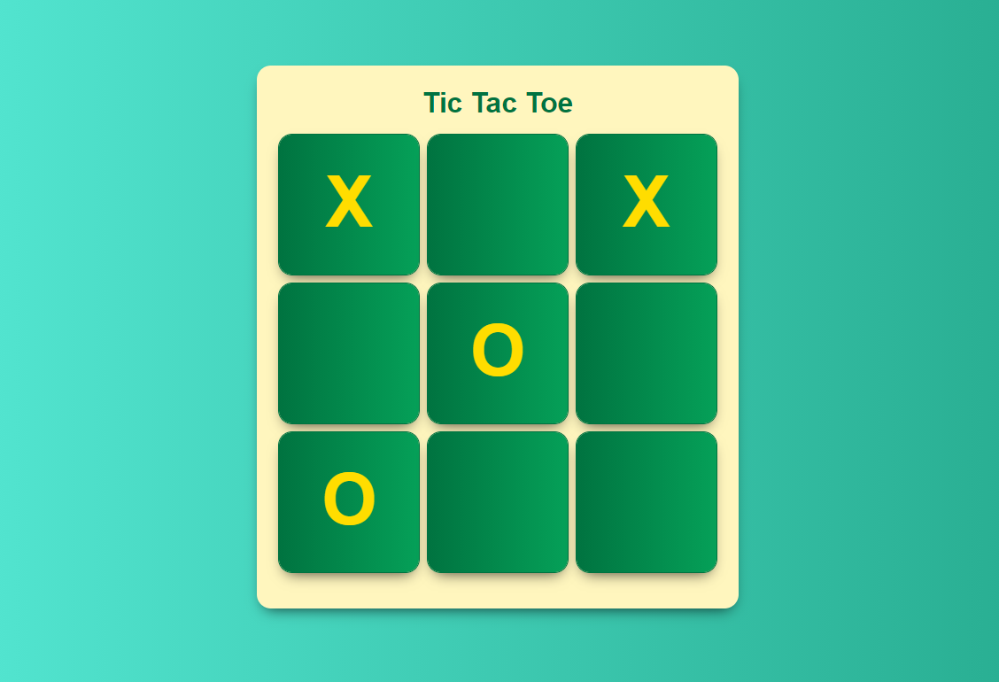

# Tic Tac Toe
Tic Tac Toe built with React JS. 

This is technically my first React "App" because  some logic is actually involved in it, till now i had only created simple webpages.

This project taught me:
* How to split an app into small components.
* How to group most of the logic to the highest order component.
* State uplifing.
* Better understanding of props in React JS.

## Technologies Used
---
* [React Js](https://reactjs.org/ "React Official Website")
* [Classname](https://www.npmjs.com/package/classname "Classname package") (Package)

## Found a bug?
---
Please report it on the issues tab.

## Thank You